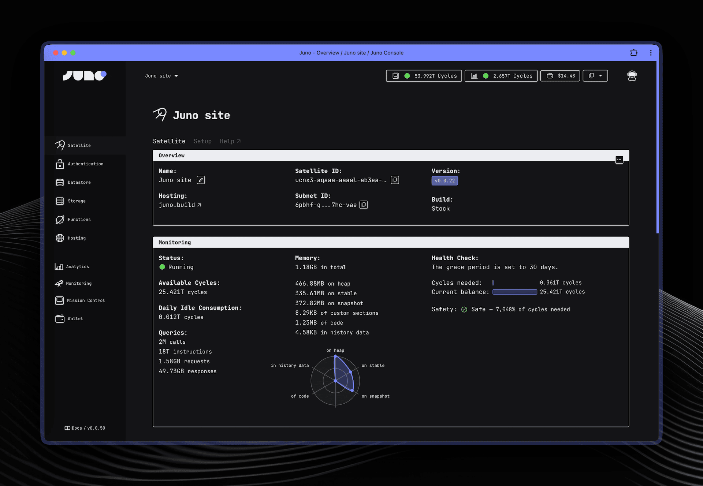

<div align="center" style="display:flex;flex-direction:column;">
  <a href="https://juno.build/">
    
  </a>

  <br />
  <br />

[](https://github.com/junobuild/juno/releases/latest)
[](https://github.com/junobuild/juno/actions/workflows/checks.yml)
[](https://github.com/junobuild/juno/actions/workflows/tests.yml)

</div>

[Juno] is an open-source, next-gen serverless platform that helps developers build and ship secure projects at scale.

- 🔑 Authentication [[Docs](https://juno.build/docs/build/authentication)]
- 📦 Datastore [[Docs](https://juno.build/docs/build/datastore)]
- 📂 File Storage [[Docs](https://juno.build/docs/build/storage)]
- 🌐 Hosting [[Docs](https://juno.build/docs/build/hosting)]
- ⚙️ Serverless Functions [[Docs](https://juno.build/docs/build/functions)]
- 📊 Analytics [[Docs](https://juno.build/docs/build/analytics)]
- 👀 Monitoring [[Docs](https://juno.build/docs/management/monitoring)]
- 💾 Snapshots [[Docs](https://juno.build/docs/management/snapshots)]

<br />



<br />

## 🚀 Introduction

Juno is a reimagined open-source platform built for modern developers who want more control, strong security, and zero operational complexity.

It offers a familiar cloud-like experience—without the DevOps overhead—powered by decentralized infrastructure.

With built-in support for authentication, storage, hosting, serverless functions, and even on-chain logic, Juno simplifies the entire backend. Everything runs in one container, giving developers full ownership and security by design.

In short, Juno is what Firebase would look like if it were built for the future. ⚡️

## 💁‍♂️️ Links & Resources

Here are some useful links:

- Looking to get started? Check out the [Guides & Examples](https://juno.build/docs/category/guides-and-examples) for step-by-step tutorials and sample code.
- Explore the full [documentation](https://juno.build) for in-depth details on using and configuring Juno.
- See the [HACKING](HACKING.md) document for instructions on running and developing Juno locally.
- Have a look at the [LICENSE](LICENSE.md) for information about licensing and limitation.

## 🖥️ Bootstrap

Planning to build a decentralized website, blog, or application? Quickly scaffold your project with ready-made templates.

```bash
# with npm
npm create juno@latest
# with pnpm
yarn create juno
# with yarn
pnpm create juno
```

## 🐳 Docker

When building your project locally or contributing to this repo, ensure you have Docker installed on your machine ([Windows](https://docs.docker.com/desktop/install/windows-install/), [MacOS](https://docs.docker.com/desktop/install/mac-install/), or [Linux](https://docs.docker.com/desktop/install/linux-install/)).

> [!NOTE]
> For MacBooks with M processors, it is important to use Docker Desktop version 4.25.0 or later, ideally the latest available version.

## 🧑‍🤝‍🧑 Community

Have questions, comments, or feedback? Join our [Discord](https://discord.gg/wHZ57Z2RAG) or [OpenChat](https://oc.app/community/vxgpi-nqaaa-aaaar-ar4lq-cai/?ref=xanzv-uaaaa-aaaaf-aneba-cai).

## 💬 Contact

Find us on X/Twitter at [@junobuild](https://twitter.com/junobuild) or email us at [hello@junobuild.ch](mailto://hello@junobuild.ch).

[juno]: https://juno.build
